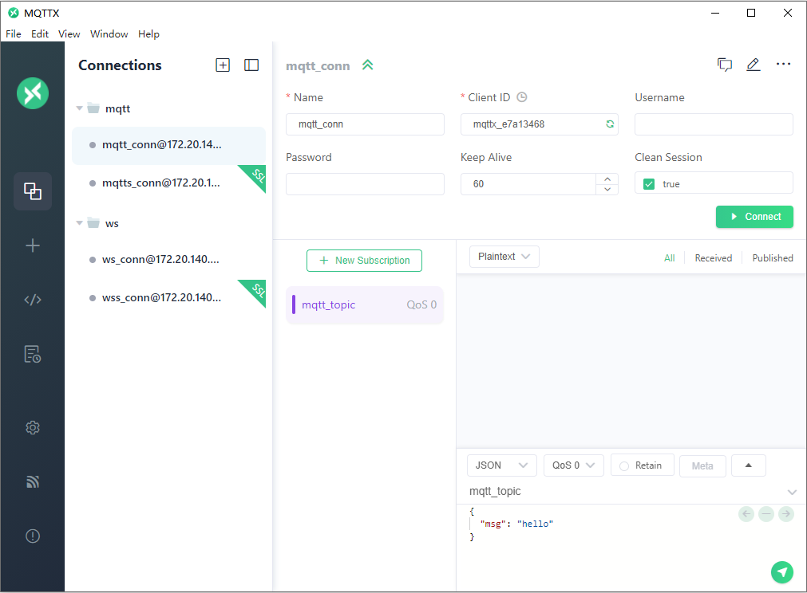
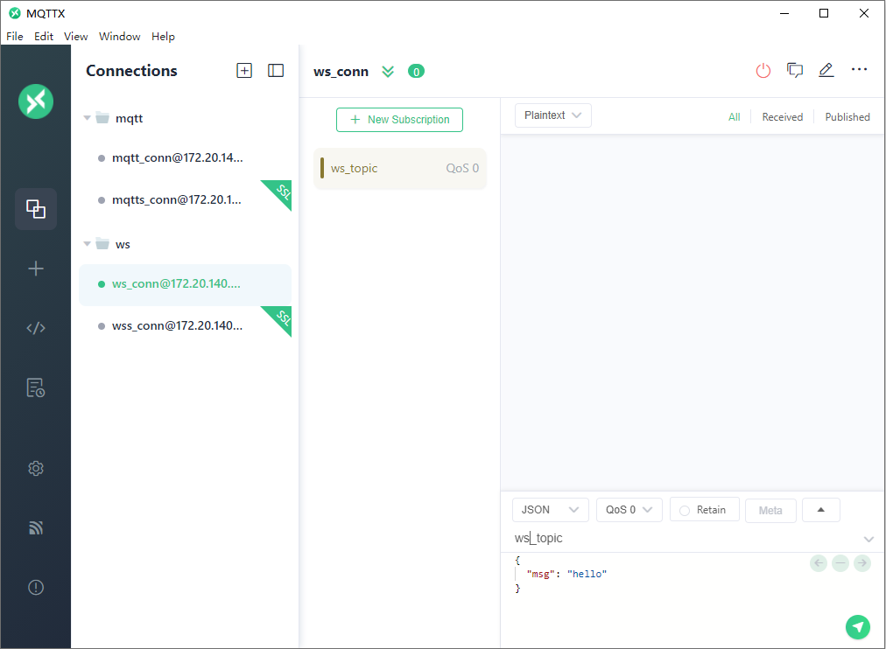
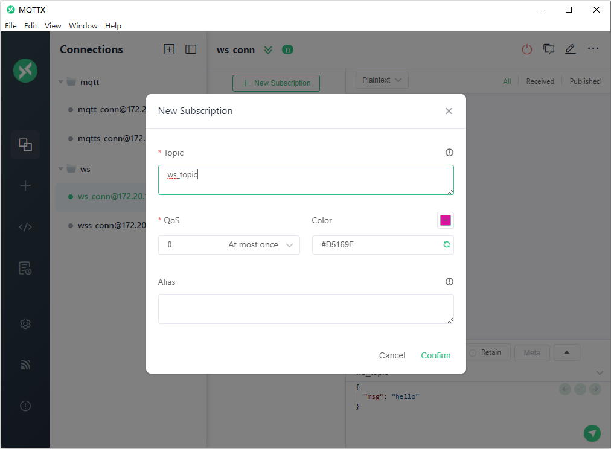
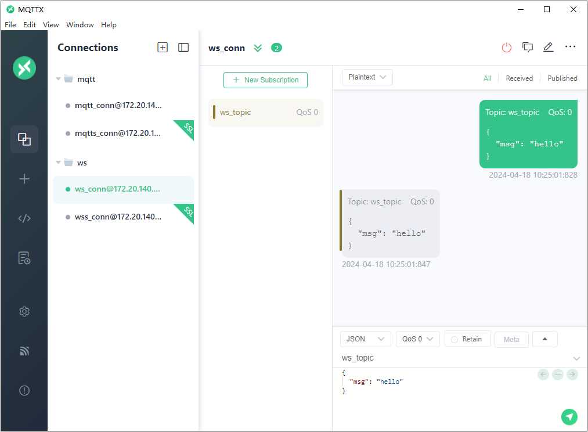
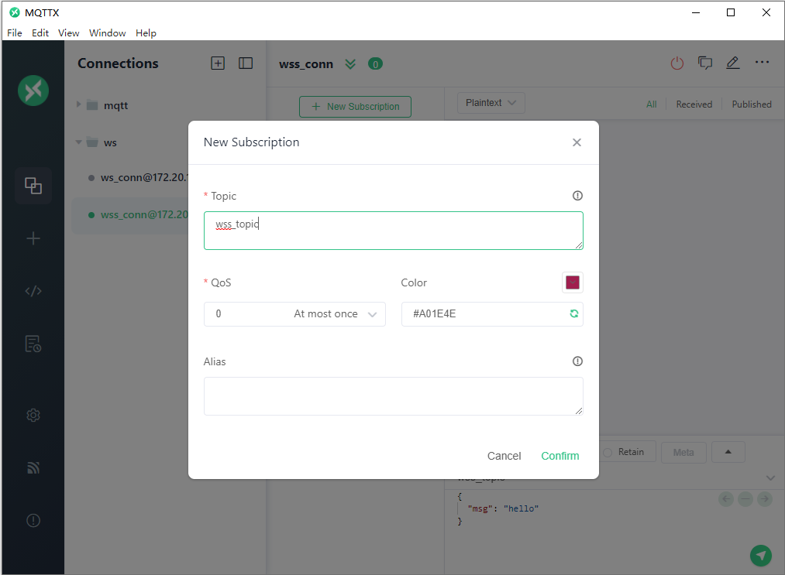
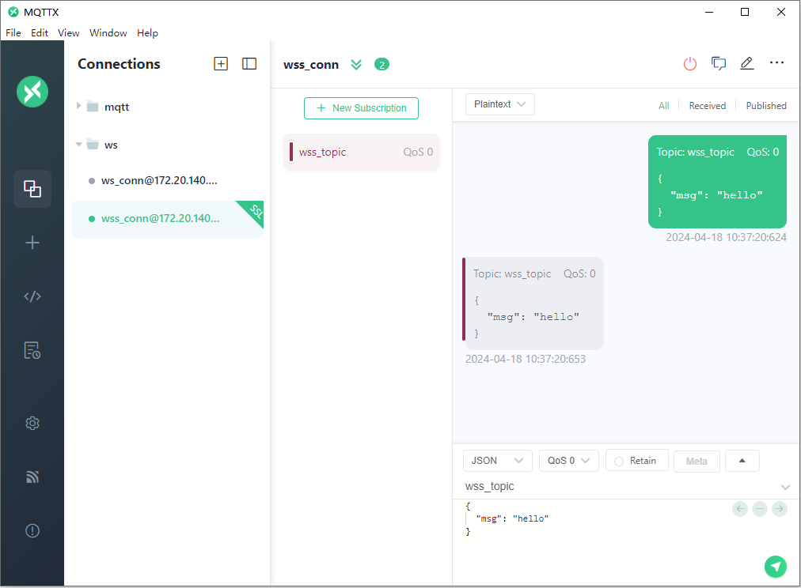

# Using MQTT over WebSocket

**Table of Contents**

[TOC]

## What is WebSocket?

WebSocket is a network communication protocol that enables two-way communication channels over a single TCP connection. Unlike HTTP, WebSocket keeps an open connection between a client and a server, which enables them to exchange data immediately and interactively. This makes WebSocket ideal for real-time interactivity applications like online games, chat applications, and stock trading systems.

The WebSocket protocol has two parts: handshake and data transfer. Handshake establishes a connection between client and server, while data transfer exchanges information over the open connection.

## Why Use MQTT over WebSocket?

MQTT over WebSockets is quickly becoming an essential conduit for IoT interactions, offering a more accessible, efficient, and enriched experience. By enabling direct MQTT data communication through any web browser, it brings the world of IoT closer to everyone.

Here are some reasons to use MQTT over WebSocket:

1. **Simplified Interaction**: Interact directly with IoT devices via any web browser. No need to worry about different protocols – MQTT over WebSocket makes it straightforward.
2. **Universal Accessibility**: With a web browser, anyone can connect to and interact with IoT devices. This opens up the world of IoT to everyone, not just those with technical expertise.
3. **Real-Time Updates**: Get data from IoT devices in real-time, providing the most current insights directly to your browser.
4. **Efficiency and Broad Support**: MQTT is a lightweight protocol and, combined with the widespread support of WebSocket in JavaScript, it allows for efficient real-time data transmission on almost any web application.
5. **Enhanced Data Visualization**: Web pages can better, faster, and more richly display various MQTT data. This advantage is particularly significant as web browsers become the de facto interface for visualizing MQTT data.

MQTT over WebSocket democratizes access to IoT devices, enabling anyone with a web browser to interact with these devices in real-time and easily.

Next, we will provide a comprehensive guide to using MQTT over WebSocket.

## Prepare MQTT Broker

### Set the MQTT server listeners.

```
mqttListeners=mqtt://127.0.0.1:1883,mqtt+ssl://127.0.0.1:8883,ws://127.0.0.1:8083,ws+ssl://127.0.0.1:8084
```

### Config mqtt broker to load tls config.

```
mqttTlsCertificateFilePath=/xxx/server.crt
mqttTlsKeyFilePath=/xxx/server.key
```

   > #### Note
   > MQTT Broker Info:
   >
   > Server: `broker.steamnative.io`
   >
   > TCP Port: `1883``
   >
   > SSL/TLS Port: `8883`
   >
   > WebSocket Port: `8083
   >
   > Secure WebSocket Port: `8084`

### How to use Proxy

```
mqttProxyEnabled=true
mqttProxyTlsEnabled=true
mqttProxyTlsPskEnabled=true
mqttProxyWsEnabled=true
mqttProxyWssEnabled=true
```

   > #### Note
   > MQTT Proxy Info:
   >
   > Server: `broker.steamnative.io`
   >
   > Proxy TCP Port: `5682``
   >
   > Proxy TLS Port: `5683`
   >
   > Proxy TLS PSK Port: `5684`
   >
   > Proxy WebSocket Port: `5083
   >
   > Proxy Secure WebSocket Port: `5084`

## Get Started with MQTT over WebSocket

### Install MQTT WebSocket Client

[MQTT.js](https://github.com/mqttjs/MQTT.js) is a fully open-source client-side library for the MQTT protocol, written in JavaScript and available for Node.js and browsers. It supports MQTT/TCP, MQTT/TLS, and MQTT/WebSocket connections.

This article will use the MQTT.js library to explain WebSocket connections.

To install MQTT.js, use the `npm` command if you have the Node.js runtime environment on your machine. You can install it globally and connect via the command line on the Node.js.

**Installation for Node.js Project**

```
# npm
npm install mqtt --save

# yarn
yarn add mqtt
```

**CDN References**

If you're working directly in the browser and prefer not to install the library, you can also use a CDN:

```
<script src="<https://unpkg.com/mqtt/dist/mqtt.min.js>"></script>

<script>
   // Globally initializes an mqtt variable
   console.log(mqtt)
</script>
```

### Connect to MQTT over WebSocket in Browser

For simplicity, we will implement this directly in the browser by creating a basic HTML file. In this file, we'll set up both a publisher and a subscriber.

```
<!DOCTYPE html>
<html lang="en">
<head>
  <meta charset="UTF-8">
  <meta name="viewport" content="width=device-width, initial-scale=1.0">
  <title>Weboscoket MQTT</title>
  <script src="<https://unpkg.com/mqtt/dist/mqtt.min.js>"></script>
</head>
<body>
  Use WebSocket client to connect to MQTT server
</body>
<script>
    const clientId = 'mqttjs_' + Math.random().toString(16).substr(2, 8)
    const host = 'ws://broker.streamnative.io:8083/mqtt'
    const options = {
      keepalive: 60,
      clientId: clientId,
      protocolId: 'MQTT',
      protocolVersion: 4,
      clean: true,
      reconnectPeriod: 1000,
      connectTimeout: 30 * 1000,
      will: {
        topic: 'WillMsg',
        payload: 'Connection Closed abnormally..!',
        qos: 0,
        retain: false
      },
    }
    console.log('Connecting mqtt client')
    const client = mqtt.connect(host, options)
    client.on('error', (err) => {
      console.log('Connection error: ', err)
      client.end()
    })
    client.on('reconnect', () => {
      console.log('Reconnecting...')
    })
</script>
```

### Connection Address

The example connection address, `ws://broker.streamnavite.io:8083/mqtt`, includes `protocol` // `hostname` . `domain` : `port` / `path`.

Common mistakes by beginners include:

- When connecting to the MQTT.js client, it is important to specify the protocol type in the connection address. This is because the client supports multiple protocols. Additionally, MQTT does not specify a port for WebSocket. MoP defaults to 8083 for non-encrypted connections, while for encrypted connections, it defaults to `8084`.
- Excluding path from the connection address: MQTT over WebSocket uniformly uses `/mqtt` as the connection path, which should be specified when connecting.
- The protocol and port are mismatched. Please use `mqtt://` for MQTT, `ws://` or `wss://` for WebSocket connections, and make sure to use encrypted WebSocket connections when under HTTPS.
- The certificate does not match the connection address.

### Connection Options

In the previous code snippet, `options` refer to the client connection options. These options include parameters such as `keepalive`, `clientId`, `username`, `password`, `clean`, `reconnectPeriod`, `connectTimeout`, and `will`. For more detailed descriptions of each option, please refer to the [MQTT.js documentation](https://github.com/mqttjs/MQTT.js#client).

### Subscribe/Unsubscribe Topics

Subscriptions can only be made after a successful connection, and the subscribed topics must comply with MQTT subscription topic rules. JavaScript's asynchronous feature means a successful connection is only ensured after the 'connect' event or by using `client.connected`.

```
client.on('connect', () => {
  console.log(`Client connected: ${clientId}`)
  // Subscribe
  client.subscribe('testtopic', { qos: 0 })
})
// Unsubscribe
client.unubscribe('testtopic', () => {
  console.log('Unsubscribed');
})
```

### Publish/Receive Messages

You can publish messages to specific topics, which must comply with the MQTT publish topic rules. You do not need to subscribe to the topic before publishing; the client must be connected.

```
// Publish
client.publish('testtopic', 'ws connection demo...!', { qos: 0, retain: false })
// Receive
client.on('message', (topic, message, packet) => {
  console.log(`Received Message: ${message.toString()} On topic: ${topic}`)
})
```

### Use WebSocket over SSL/TLS

Secure WebSocket connections can be established using the WSS protocol (WebSocket Secure), essentially a WebSocket over a TLS (previously SSL) connection. TLS is used to encrypt the data that is sent over the connection, ensuring data privacy and integrity, as well as authentication.


To use WebSocket over TLS with MQTT.js, you need to change the protocol in the broker address from `ws` to `wss`. However, you must also ensure that the broker you are connecting to supports WSS connections and that the port number is correct for WSS. For example, MoP uses port `8084` for WSS connections by default.


Here's an example of how you might establish a secure connection:

```
const host = 'wss://broker.steamnative.io:8084/mqtt'
const options = {
  // other options as before
}

const client = mqtt.connect(host, options)

// rest of your code...
```

Remember, if you're connecting to a broker over WSS from a web page served over HTTPS, you must ensure the broker's certificate is trusted by the client's browser. This usually means the certificate must be issued by a well-known certificate authority and not be expired, revoked, or used for a different domain. If you're using a self-signed certificate for the broker, you must manually add it to the browser's trust store.

For more details and potential issues related to using WebSocket over TLS, please refer to the [MQTT.js documentation](https://github.com/mqttjs/MQTT.js#client) or the appropriate tutorial for your MQTT broker.

> *Note: When using WebSocket connections in a browser, it is not possible to establish two-way authenticated connections. However, this feature is supported in most other programming language environments. For example, in Node.js:*

```
const mqtt = require('mqtt')
const fs = require('fs')
const path = require('path')

const KEY = fs.readFileSync(path.join(__dirname, '/tls-key.pem'))
const CERT = fs.readFileSync(path.join(__dirname, '/tls-cert.pem'))
const TRUSTED_CA_LIST = fs.readFileSync(path.join(__dirname, '/crt.ca.cg.pem'))


const host = 'wss://broker.streamnative.io:8084/mqtt'

const options = {
    ...
  key: KEY,
  cert: CERT,
  rejectUnauthorized: true,
  ca: TRUSTED_CA_LIST,
}

const client = mqtt.connect(host, options)
```

## Test

We can use a tool like [MQTTX](https://mqttx.app/), which provides a GUI for MQTT interactions. Here's how you can test it:

1. download and install

   

2. start mqttx

   

### WS

1. New websocket connection

   

2. connect websocket

   

3. Add a subscription

   

4. Publish message

   

### WSS

1. New websocket connection

   

2. connect websocket with ssl

   

3. Add a subscription

   

4. Publish message

   

## Q&A

### What is the difference between MQTT and WebSocket?

The main difference lies in the protocol design and use case: MQTT is a message transfer protocol used for publish/subscribe communication, while WebSocket is a communication protocol used for real-time bidirectional communication.

### Can WSS support two-way authentication connections in the browser?

No, it is impossible to specify a client certificate using JavaScript code when establishing a connection in a browser, even if client certificates are set up in your OS certificate store or potentially some smart card. This means that MQTT.js cannot do so. Additionally, you cannot specify a Certificate Authority (CA) either, as it is controlled by the browser.

Reference: [How to use TLS/SSL two-way authentication connections in browser? · Issue #1515 · mqttjs/MQTT.js](https://github.com/mqttjs/MQTT.js/issues/1515)


### Can it be used outside of a browser environment?

Yes, you can use MQTT over WebSocket in non-browser environments. Different programming languages have corresponding MQTT client libraries, such as Python, Node.js, Golang, etc., allowing you to connect to MQTT brokers and communicate using MQTT over WebSocket in your chosen environment. When TLS/SSL connections are supported, you can also use mutual certificate authentication.

### Why do I need to fill in a path when connecting to MoP?


A path must be filled in when using WebSocket to connect to [MoP](https://www.streamnative.io). This is because MoP follows the unified path specification of MQTT-WebSocket. This specification requires a specific path to be specified in WebSocket connections to identify and distinguish MQTT over WebSocket traffic. This path routes MQTT over WebSocket traffic to the MQTT Broker for processing.


In MoP, the default path for MQTT over WebSocket is `/mqtt`. This is set according to the specification. Therefore, when connecting to MoP, this path must be included in the WebSocket address to ensure the connection is correctly routed to the MQTT broker.

### When developing MQTT web applications, whether using Vue.js or React, can I only use WebSocket connections?

If you are developing applications in a browser, you can only use WebSocket connections to establish MQTT over WebSocket connections.

## Summary

This quickstart guide covers the basics of using MQTT over WebSocket to establish real-time communication between MQTT brokers and web browsers. We walk you through the essential steps, including establishing the WebSocket connection, initializing the MQTT client, subscribing and publishing messages, and testing the connection.
